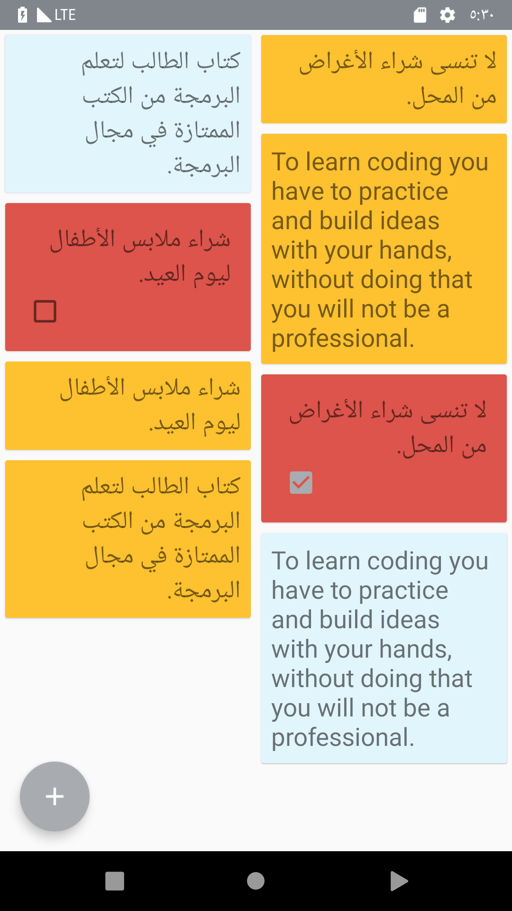
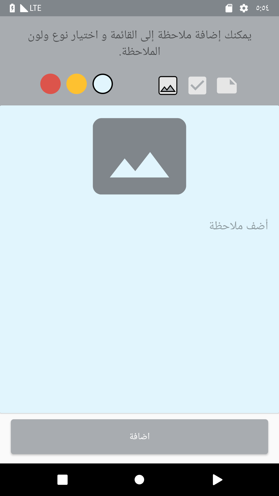
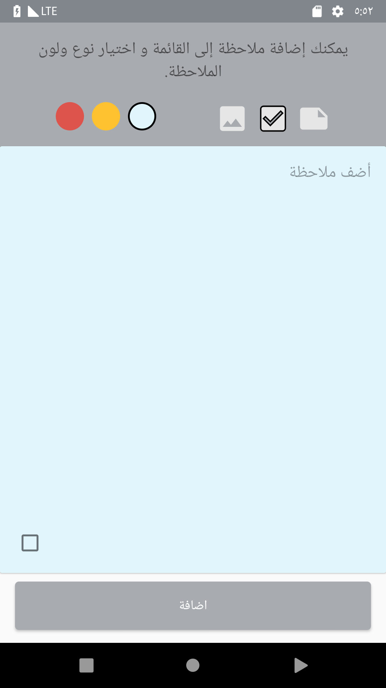
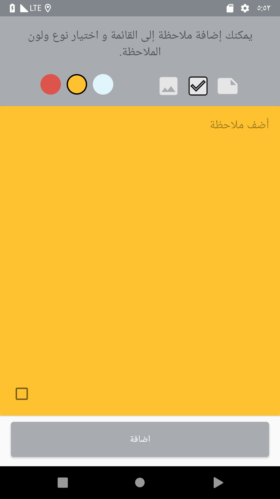
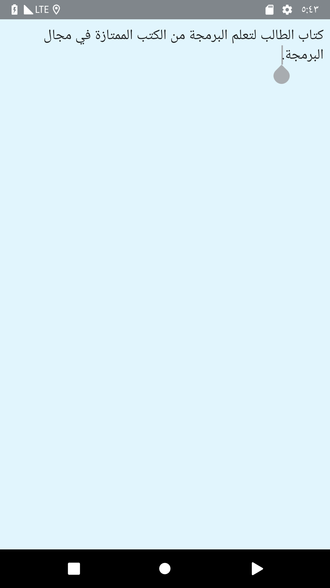
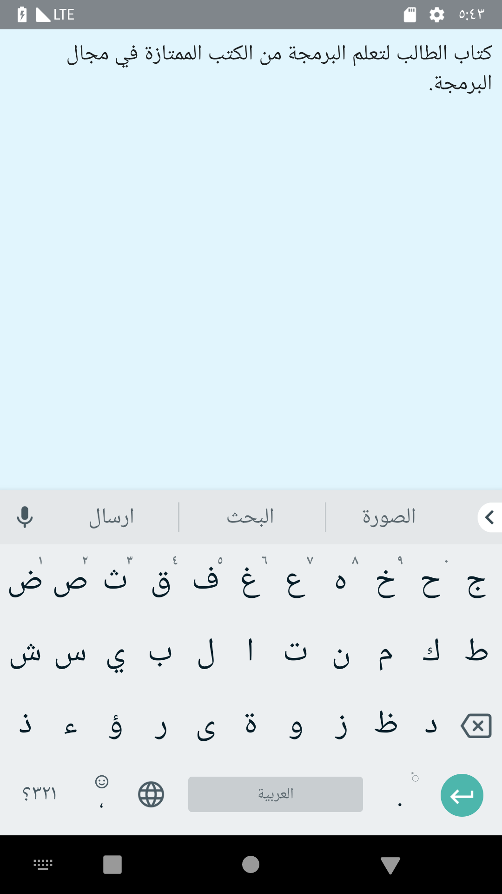

# 
نبذة عن المشروع

ننسى أشياء نريد أن نفعلها فى كثير من الاوقات، احيانا تظهر فى عقولنا فكرة او مهمة نود تنفيذها ولكن بمجرد أن تمر دقائق قليلة ننساها . لذلك نود تطوير تطبيق عبارة عن مذكرة.

التطبيق يمكن المستخدم من اضافة مذكرة جديدة بثلاثة أنواع مذكرة نصية، مذكرة نصية مع إمكانية التعليم عليها عندما نقوم بأدائها وأخيرا مذكرة تحتوي على صورة ونص.

بمجرد أن يضيف المستخدم الفكرة تظهر فى القائمة. كذلك يمكننا التعديل على كل مذكرة بالضغط عليها.

# 
الهدف من هذا المشروع ؟
 

في الدروس السابقة تعرفنا على المفاهيم المتعلقة بالقوائم في تطبيقات الأندرويد، وقمنا بتطبيقها بأكثر من شكل. في هذا المشروع سنقوم بالتركيز على مفاهيم الـ RecyclerView والـ Adapters مع بعض التحديات. حيث سنطلب منك عرض أكثر من شكل للعناصر في قائمة واحدة.

# 
متطلبات المشروع

يجب أن يحتوي المشروع على المزايا التالية:
<ul>
<li>قم بتطوير Activity رئيسية تعرض المذكرات أو المهام في قائمة والتي يقوم بإضافتها المستخدم.</li> 
<li>قم بتطوير Activity تمكن المستخدم من إدخال المذكرة أو المهمة الجديدة. هذه الـ activity تقوم بإرسال البيانات التي أدخلها المستخدم كنتيجة للـ activity التى استدعتها. ملاحظة: لا تسمح بارسال بيانات فارغة.</li>
<li>قم باستخدام الـ activity التي طورتها عن طريق اضافة زر لاضافة مذكرة جديدة داخل الـ activity الرئيسية التي تحتوي القائمة.</li>
<li>هذا التطبيق يوفر ثلاثة أنواع من المذكرات، ويجب عرض العنصر الخاص بكل مذكرة في القائمة على شكل CardView مختلف يحتوي البيانات ليعبر عن نوع المذكرة.</li>
<li>بالنسبه لطريقة العرض يمكنك استخدام StaggeredGridLayoutManager. حيث يتم استخدامه لاستبدال كل من GridLayoutManager و LinearLayoutManager في الـ RecyclerView لعرض العناصر بطريقة مميزة، و يمكنك التعرف عليه من خلال <a href="https://developer.android.com/reference/android/support/v7/widget/StaggeredGridLayoutManager.html">الرابط</a></li>
<li>يمكن للمستخدم الضغط على أي مذكرة ليتم التعديل على محتواها. لذلك ستحتاج إلى تطوير Activity لعرض تفاصيل المذكرة. كذلك يمكن إزالة مذكرة عن طريق الضغط المطول.</li>
<li>يجب إنشاء class ليمثل بيانات كل نوع من المذكرات. هذه الـ classes سيتم استخدامها في القائمة لعرض البيانات. ملاحظة: يمكنك استخدام مفهوم الوراثة Inheritance و جمل if لتتمكن من استخدام أكثر من class لعرض البيانات في قائمة واحدة.
</li>
<li>نقاط اضافية: تغير خلفية المهم التي تم إنجازها للأخضر.
</li>
</ul>

# 
الشاشة الرئيسية

  

# 
شاشة إضافة مذكرة

  

  

  
  # 
شاشة تفاصيل المذكرة

  

  

